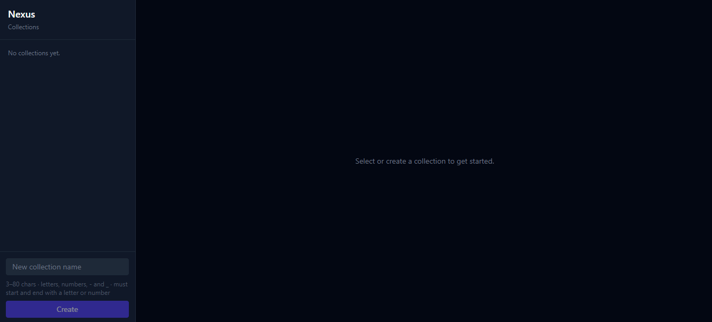

<div align="center">

# Nexus

**Self-hosted, open-source RAG: upload documents, build knowledge bases, get cited answers.**

[](LICENSE)
[](https://www.python.org/)
[](https://fastapi.tiangolo.com/)
[](https://react.dev/)
[](https://docs.docker.com/compose/)

</div>

---



---

## What it does

Nexus is a RAG (Retrieval-augmented generation) platform you run yourself. You upload documents (PDFs or plain text), organize them into named collections, and ask questions in natural language. The system finds the most semantically relevant passages and generates an answer that cites its sources.

Your documents stay on your infrastructure. Queries and embeddings are sent to the OpenAI API.

---

## Features

- **Multi-collection knowledge bases**: create, populate, and delete named collections independently
- **Multi-format ingestion**: PDFs and plain text files up to 20 MB; page numbers preserved for PDFs
- **Semantic search**: `text-embedding-3-small` embeddings in ChromaDB; finds related content even without exact keyword matches
- **Streaming answers**: responses stream token-by-token via Server-Sent Events with inline `[1]` `[2]` citations
- **Source transparency**: every answer exposes the exact chunk it was drawn from, expandable in the UI
- **Persistent storage**: ChromaDB data lives in a named Docker volume and survives container restarts
- **One-command start**: the entire stack runs with `docker compose up`

---

## Tech Stack

| Layer | Technology |
|---|---|
| Frontend | React 19, TypeScript, Tailwind CSS, Vite |
| Backend | FastAPI, Python 3.12, uvicorn |
| RAG pipeline | LangChain, OpenAI (`text-embedding-3-small`, `gpt-4o-mini`) |
| Vector store | ChromaDB |
| Infrastructure | Docker, Docker Compose, nginx |

**Estimated API cost:** roughly $2-5 in OpenAI credits for a full session of ingestion and querying. `text-embedding-3-small` and `gpt-4o-mini` are the cheapest capable models available.

---

## Quickstart

### Prerequisites

- [Docker Desktop](https://www.docker.com/products/docker-desktop/) with Compose
- An [OpenAI API key](https://platform.openai.com/api-keys)

> **Windows users:** run everything inside a WSL2 Ubuntu terminal, not PowerShell. Keep project files inside WSL2 (`~/nexus`), not on the `C:` drive; Docker volume mounts are significantly slower from the Windows filesystem.

### 1. Clone

```bash
git clone https://github.com/kasramosh/open-nexus.git
cd open-nexus
```

### 2. Configure

```bash
cp .env.example .env
# open .env and paste your OpenAI API key
```

### 3. Start

```bash
docker compose up
```

Three services come up:

| Service | URL |
|---|---|
| React app | http://localhost |
| FastAPI backend | http://localhost:8000 |
| ChromaDB | internal (backend only) |

To stop while keeping your data:
```bash
docker compose down
```

To stop and wipe all stored data:
```bash
docker compose down -v
```

---

## Usage

1. **Create a collection**: click "New collection" in the sidebar and give it a name
2. **Upload documents**: PDF or `.txt`, up to 20 MB; Nexus chunks and embeds them automatically
3. **Ask a question**: the answer streams in with numbered citations; click any citation to see the exact source passage

---

## API Reference

The FastAPI backend is usable as a standalone API at `http://localhost:8000`. Interactive docs at `http://localhost:8000/docs`.

### Collections

| Method | Path | Description |
|---|---|---|
| `POST` | `/collections` | Create a collection |
| `GET` | `/collections` | List all collections |
| `DELETE` | `/collections/{id}` | Delete collection and all its documents |

Collection names: 3-80 characters, alphanumeric, hyphens and underscores allowed.

### Documents

| Method | Path | Description |
|---|---|---|
| `POST` | `/collections/{id}/documents` | Upload PDF or TXT |
| `GET` | `/collections/{id}/documents` | List documents |
| `DELETE` | `/collections/{id}/documents/{source}` | Remove a document |

### Query

| Method | Path | Description |
|---|---|---|
| `POST` | `/collections/{id}/query` | JSON response |
| `POST` | `/collections/{id}/query/stream` | Server-Sent Events stream |

```json
// POST /collections/{id}/query
{ "query": "What are the key findings?", "top_k": 5 }
```

```
// Streaming events
data: {"type": "sources", "sources": [...]}
data: {"type": "token", "content": "The key findings are..."}
data: {"type": "done"}
```

### Health

```
GET /health → {"status": "ok"}
```

---

## Project Structure

```
nexus/
├── backend/
│   ├── app/
│   │   ├── main.py              # FastAPI entry point, CORS, routers
│   │   ├── models.py            # Pydantic request/response models
│   │   ├── routes/
│   │   │   ├── collections.py
│   │   │   ├── documents.py
│   │   │   └── query.py
│   │   └── rag/
│   │       ├── pipeline.py      # Orchestrator
│   │       ├── chunker.py       # PDF/text splitting (800 tokens, 100 overlap)
│   │       ├── embedder.py      # OpenAI embeddings + ChromaDB
│   │       ├── retriever.py     # Semantic similarity search
│   │       └── generator.py     # GPT-4o-mini generation + SSE streaming
│   ├── tests/
│   └── Dockerfile
├── frontend/
│   ├── src/
│   │   ├── components/
│   │   │   ├── CollectionList.tsx
│   │   │   ├── DocumentUpload.tsx
│   │   │   └── ChatInterface.tsx
│   │   └── api/client.ts        # Typed fetch + SSE client
│   ├── nginx.conf
│   └── Dockerfile
├── docker-compose.yml
└── .env.example
```

---

## Configuration

Copy `.env.example` to `.env`. All other variables have sensible defaults for local Docker use.

| Variable | Required | Default | Description |
|---|---|---|---|
| `OPENAI_API_KEY` | Yes | - | Your OpenAI API key |
| `CHROMA_HOST` | No | in-memory | Set to `chromadb` when running in Docker |
| `CHROMA_PORT` | No | `8000` | ChromaDB port |
| `ALLOWED_ORIGINS` | No | `http://localhost` | CORS allowed origins |

---

## Local Development (no Docker)

### Backend

```bash
cd backend
python3 -m venv .venv && source .venv/bin/activate
pip install -r requirements.txt
uvicorn app.main:app --reload
# → http://localhost:8000
```

### Frontend

```bash
cd frontend
npm install
npm run dev
# → http://localhost:5173
```

### Tests

```bash
cd backend && pytest
```

---

## Roadmap

- [x] RAG pipeline: chunking, embedding, semantic retrieval, cited generation
- [x] REST API: collections, documents, streaming query endpoints
- [x] React frontend: collection sidebar, document upload, streaming chat with citations
- [x] Docker Compose: full stack runs with a single command
- [ ] GitHub Actions CI/CD
- [ ] AWS deployment
- [ ] RAG evaluation dashboard
- [ ] HTTPS / custom domain
- [ ] URL ingestion

---

## Contributing

PRs are welcome. To get started:

1. Fork the repo and create a branch: `git checkout -b feat/your-idea`
2. Start the stack locally (see [Local Development](#local-development-no-docker) above)
3. Make your changes and run `pytest` to verify
4. Open a pull request with a short description of what changed and why

For larger changes, open an issue first to discuss the approach.

---

## License

MIT
